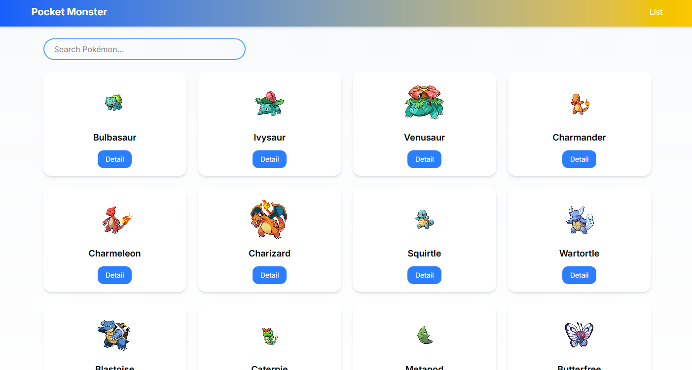
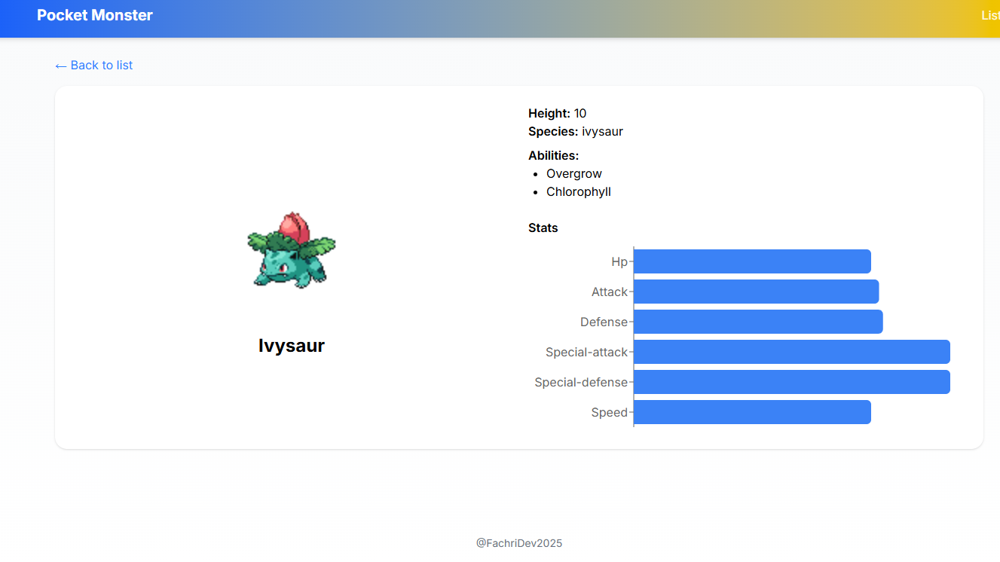

# 🎮 Pokémon Search App

A simple Pokémon search and listing web app built with **React (TypeScript), Vite, TailwindCSS, React Query, and Axios**.  
The app allows you to:

- Browse Pokémon with pagination
- Search Pokémon by name
- View Pokémon details (name, image, abilities, height, species, etc.)
- Smooth UI with Tailwind styling

---

## ⚡ Tech Stack

- [React](https://reactjs.org/) + [TypeScript](https://www.typescriptlang.org/)
- [Vite](https://vitejs.dev/) - lightning-fast dev server
- [TailwindCSS](https://tailwindcss.com/) - utility-first CSS
- [React Query](https://tanstack.com/query/latest) - data fetching & caching
- [Axios](https://axios-http.com/) - HTTP client
- [Framer Motion](https://www.framer.com/motion/) - animations
- [PokéAPI](https://pokeapi.co/) - Pokémon data source

---

## 📦 Installation

Clone the repository:

```bash
git clone https://github.com/yourusername/pokemon-app.git
cd pokemon-app

npm install
# or
yarn install
# Run the development server:
npm run dev
# Build for production:
npm run build
# Preview production build:
npm run preview
```
<!-- previeww -->


